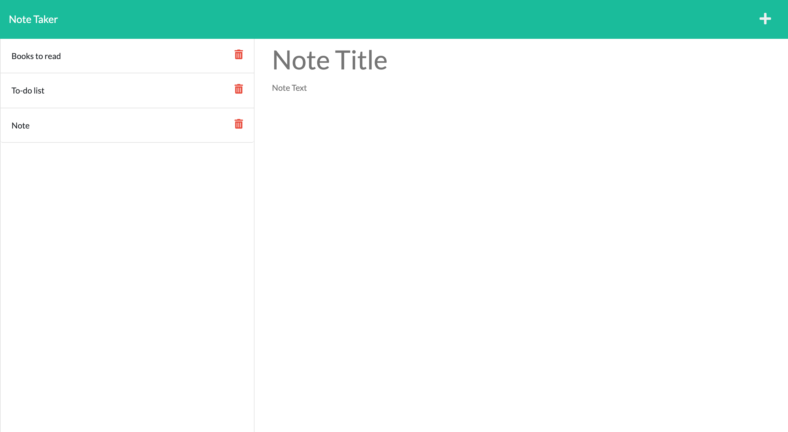

# Note Taker

# Links

Heroku:
https://express-notetaker-application.herokuapp.com/

## Description

An application called Note Taker that can be used to write and save notes.

## User Stories

` AS A User I WANT to be able to write and save notes SO THAT I can organize my thoughts and keep track of tasks I need to complete`

## Tools/Technologies

- HTML
- CSS
- JavaScript
- Node
- Nodemon
- Express

## Endpoints

### /api

- GET /notes
  This will return an array of notes

See sample response:

```json
[
  {
    "id": "4d2ca0f3-597d-488a-80c7-a8aad04c9b91",
    "title": "Test Title",
    "text": "Test text"
  },
  {
    "id": "26d33b16-7277-45f1-b8ec-8acdd5b6fec7",
    "title": "Test Title",
    "text": "Test text"
  }
]
```

- POST /notes
  This will create a new note

POST body:

```json
{
  "title": "yur title",
  "text": "your text"
}
```

- DELETE /notes/:id
  This will delete a note by ID

## Screenshots


